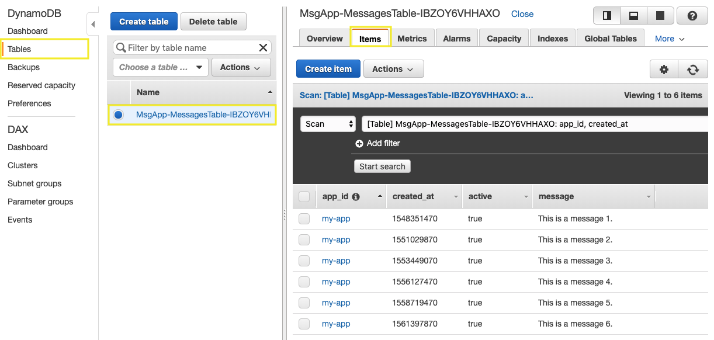
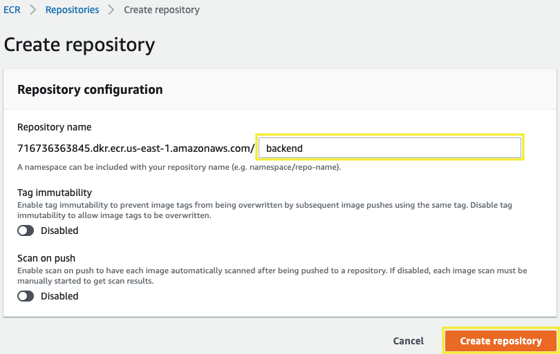
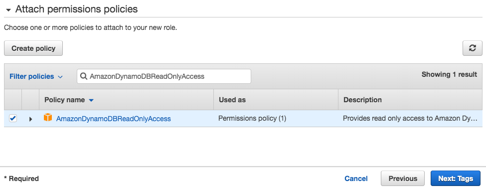
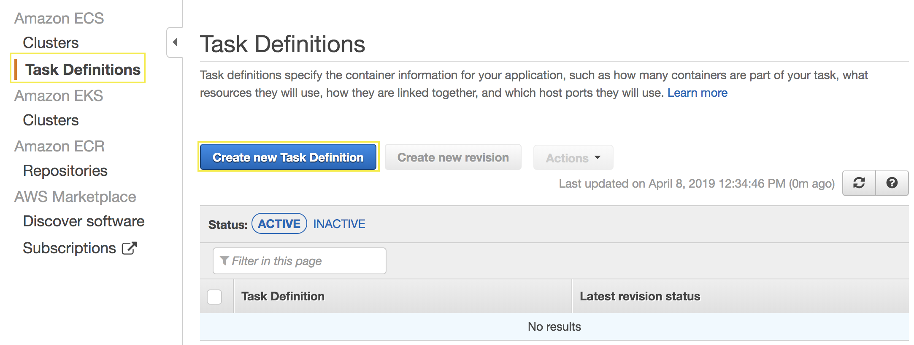
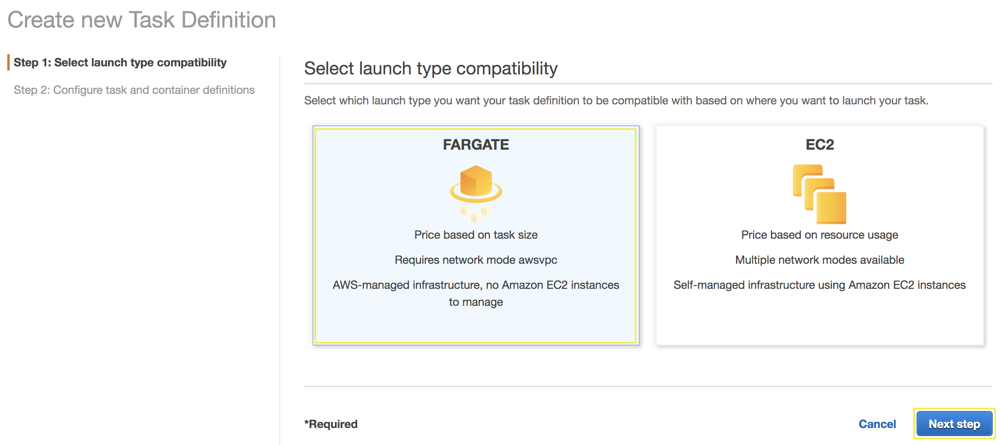
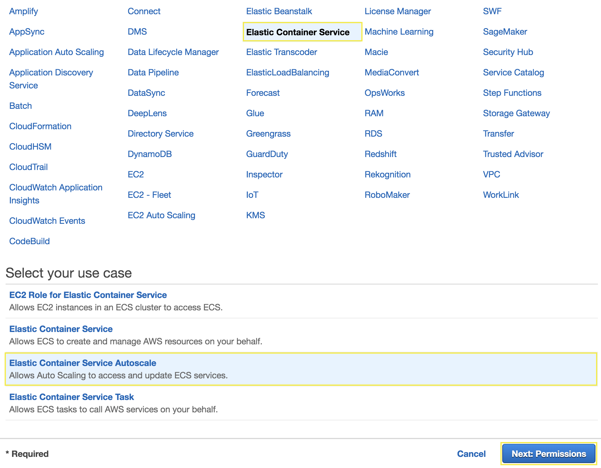
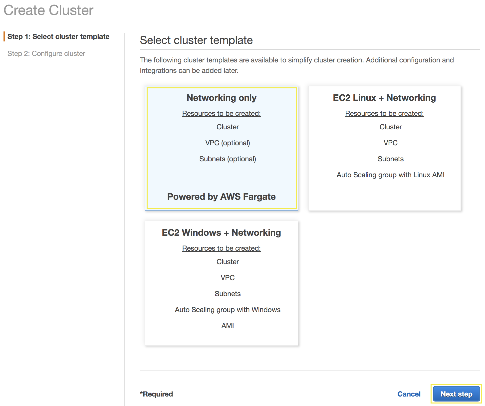
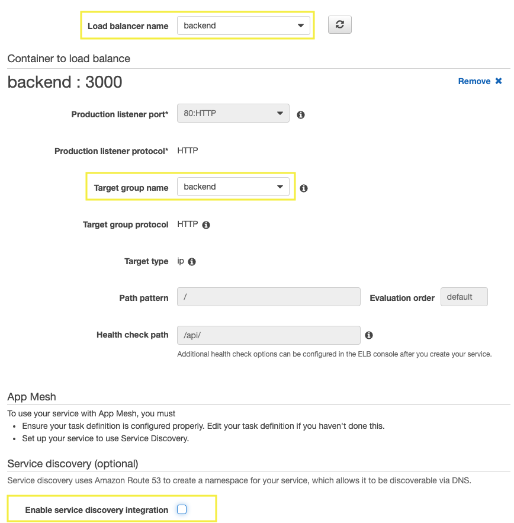
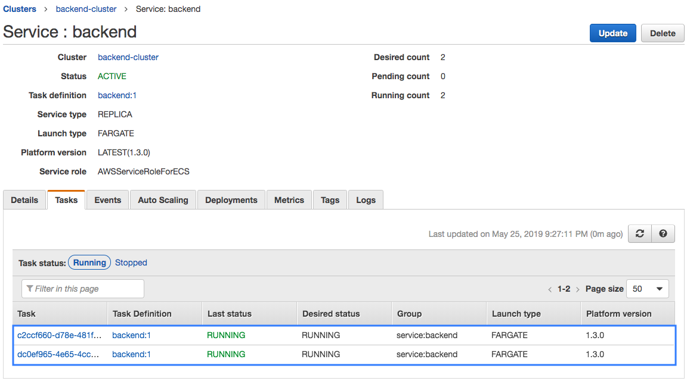
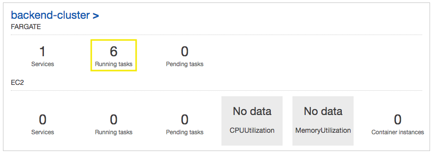

# Deploy a Node.js backend with Amazon ECS

## 1. Install requirements

1.1\. Open the AWS Cloud9 console at https://console.aws.amazon.com/cloud9/.

1.2\. In the list of environments, for the environment you want to open, inside of the card, choose **Open IDE**.


1.3\. Inside the Cloud9 environment, in the **bash** terminal install the JQ command.

``` bash
sudo yum install jq -y
```

1.4\. Install the latest Boto 3 release via **pip**.

``` bash
python -m pip install --user boto3
```

## 2. Clone the repository project from GitHub

2.1 Inside your **environment** folder clone the repository project from GitHub.

``` bash
cd ~/environment/
git clone https://github.com/aurbac/msg-app-backend.git
cd msg-app-backend/
```

## 3. Create a DynamoDB table with AWS CloudFormation

3.1\. Create a simple DynamoDB table to store the messages for our application, by executing the following command the table is created using AWS CloudFormation.

``` bash
aws cloudformation create-stack --stack-name MsgApp --template-body file://db/msg-app-dynamodb.json --parameters ParameterKey=BillOnDemand,ParameterValue=true ParameterKey=ReadCapacityUnits,ParameterValue=5 ParameterKey=WriteCapacityUnits,ParameterValue=10
```

3.2\. Wait 30 seconds to obtain the DynamoDB Table name created and export it as an environment variable with the following command.

``` bash
export MY_TABLE_NAME=`aws cloudformation describe-stacks --stack-name MsgApp | jq '.Stacks[0].Outputs[0].OutputValue' | tr -d \"`
echo $MY_TABLE_NAME
```

3.3\. Feed the DynamoDB Table.

``` bash
python db/batch_writing.py
```

3.4\. Open the Amazon DynamoDB console at https://console.aws.amazon.com/dynamodb/, in **Tables** section, select your table and explore the **Items** inserted.



## 4. Create Service Linked Roles required for your new AWS account

4.1\. Inside the Cloud9 environment, in the **bash** terminal execute the following commands to make sure that service linked roles exist for Load Balancers and ECS in your new AWS account, if they do not exist they are created.

``` bash
aws iam get-role --role-name "AWSServiceRoleForElasticLoadBalancing" || aws iam create-service-linked-role --aws-service-name "elasticloadbalancing.amazonaws.com"
aws iam get-role --role-name "AWSServiceRoleForECS" || aws iam create-service-linked-role --aws-service-name "ecs.amazonaws.com"
```

## 5. Create the backend docker image and upload to Amazon ECR

5.1\. Go to your **msg-app-backend** folder.

``` bash
cd ~/environment/msg-app-backend/
```

5.2\. Install the node dependencies.

``` bash
npm install
```

5.3\. Open the Amazon ECR console at https://console.aws.amazon.com/ecr/repositories/.

5.4\. Click on **Create repository**, for the **Repository name** type `backend` and click **Create repository**.



5.5\. From the **Repositories** list, copy the **URI** for the **backend** repository, you will use it later.


5.6\. Click on the repository name **backend** and then click on **View push commands**.

5.7\. Go back to your Cloud9 environment in your backend folder and execute the 5 commands of **Push commands for backend** (macOS/Linux).


5.8\. After pushing to AWS repository you will see the following image in https://console.aws.amazon.com/ecr/repositories/backend/.


## 6. Create your Amazon ECS Task Execution IAM Role

6.1\. Open the IAM console at https://console.aws.amazon.com/iam/.

6.2\. Choose **Roles**, then **Create role**.

6.3\. Choose **Elastic Container Service** from the list of services, scroll down and choose **Elastic Container Service Task** that allows ECS tasks to call AWS services on your behalf for your use case, then **Next: Permissions**.


6.4\. For **attach permissions policies** filter by typing `AmazonECSTaskExecutionRolePolicy` and from the list select **AmazonECSTaskExecutionRolePolicy**, choose **Next: Tags**.


6.5\. For **Add tags** choose **Next: Review**.

6.6\. Give your role a **Name**, type `ecsTaskExecutionRole` and choose **Create Role**.


## 7. Create your Amazon ECS Task IAM Role for Amazon DynamoDB Read Only Access

7.1\. Open the IAM console at https://console.aws.amazon.com/iam/.

7.2\. Choose **Roles**, then **Create role**.

7.3\. Choose **Elastic Container Service** from the list of services, scroll down and choose **Elastic Container Service Task** that allows ECS tasks to call AWS services on your behalf for your use case, then **Next: Permissions**.


7.4\. For **attach permissions policies** filter by typing `AmazonDynamoDBReadOnlyAccess` and from the list select **AmazonDynamoDBReadOnlyAccess**, choose **Next: Tags**.



7.5\. For **Add tags** choose **Next: Review**.

7.6\. Give your role a **Name**, type `ecsDynamoDBRole` and choose **Create Role**.


## 8. Create the Task Definition

8.1\. Open the Amazon ECS console at https://console.aws.amazon.com/ecs/.

8.2\. In the navigation pane, under **Amazon ECS**, choose **Task Definitions**.

8.3\. Choose **Create new Task Definition**.



8.4\. On the **Select launch type compatibility** use **FARGATE** and click on **Next step**.



8.5\. Complete the **Configure task and container definitions** page as follows:

* **Task Definition Name**: **``backend``**
* **Task Role**: Select **``ecsDynamoDBRole``**
* **Task execution role**: Select **``ecsTaskExecutionRole``**
* **Task memory (GB)**: Select **``0.5GB``**
* **Task CPU (vCPU)**: select **``0.25 vCPU``**

8.6\. Click on **Add container** and complete as follow:

* **Container Name**: **``backend``**
* **Image**: paste the URI repository that you copied earlier in step 1.5.
* **Port mappings**: **``3000``** 


8.7\. Scroll down for the **ENVIRONMENT** section and add the variables and values as follows and choose **Add**:

* **DYNAMODB_MESSAGES_TABLE** : **Value** : **``MsgApp-MessagesTable-XXXXXXXXXXXX``** (Paste the name of your DynamoDB table)
* **APP_ID** : **Value** : **``my-app``**


8.8\. Click on **Create** and click on **View task definition**.


## 9. Create your Amazon ECS Service Auto Scaling IAM Role

9.1\. Open the IAM console at https://console.aws.amazon.com/iam/.

9.2\. Choose **Roles**, then **Create role**.

9.3\. Choose **Elastic Container Service** from the list of services, scroll down and choose **Elastic Container Service Autoscale** that allows Auto Scaling to access and update ECS services, then **Next: Permissions**.



9.4\. In **attach permissions policies**, the **AmazonEC2ContainerServiceAutoscaleRole** policy is selected, choose **Next: Tags**.


9.5\. For **Add tags** choose **Next: Review**.

9.6\. Give your role a **Name**, type `ecsAutoscaleRole` and choose **Create Role**.


## 10. Create an Amazon ECS cluster and Service for the backend

10.1\. Open the Amazon ECS console at https://console.aws.amazon.com/ecs/.

10.2\. In the navigation pane, under **Amazon ECS**, choose **Clusters**.

10.3\. Choose **Create Cluster**.


10.4\. Select the option **Networking only - Powered by AWS Fargate** and click on **Next step**.



10.5\. For **Cluster name** type `backend-cluster` and click on **Create**.


10.6\. Click on **View Cluster**.

10.7\. In the **Services** section, click on **Create**.


10.8\. Complete the **Configure service** page as follows:

* **Launch type**: **``FARGATE``**
* **Task Definition**: **``backend``**
* **Cluster**: **``backend-cluster``**
* **Service name**: **``backend``**
* **Number of tasks**: **``1``** 


10.9\. Click on **Next step**.

10.10\. Complete the **Configure network** page as follows:

* **Cluster VPC**: `My VPC`
* **Subnets**: Select `Private Subnet 01` and `Private Subnet 02`
* **Auto-assign public IP**: `DISABLED`


10.11\. For **``Security Groups``** click on **Edit**.

10.12\. Complete as follows and click on **Save**:

* **Type**: **``Custom TCP``**
* **Port range**: **``3000``**


10.13\. For **Load balancer type** select **``Application Load Balancer``**.

10.14\. For **Load balancer name** select **``backend``**.

10.15\. Click on **Add to load balancer**.


10.16\. For **Target group name** select **``backend``**.

10.17\. Uncheck the **Enable service discovery integration** and click on **Next step**.



10.18\. Complete the **Set Auto Scaling (optional)** page as follows and click on **Next step**.

* **Service Auto Scaling**: Select **Configure Service Auto Scaling to adjust your service’s desired count**
* **Minimum number of tasks**: **``2``**
* **Desired number of tasks**: **``2``**
* **Maximum number of tasks**: **``6``**
* **IAM role for Service Auto Scaling**: Select **``ecsAutoscaleRole``**
* **Policy name**: **``RequestCount``**
* **ECS service metric**: **``ALBRequestCountPerTarget``**
* **Target value**: **``100``**


!!! info
    **ALBRequestCountPerTarget** - Number of requests completed per target in an Application Load Balancer or a Network Load Balancer target group.

10.19\. Click on **Create Service** and click on **View Service** once the creation is finished.

10.20\. Wait a few seconds, you will see two tasks in running status.



10.21\. Open the Amazon EC2 console at https://console.aws.amazon.com/ec2/.

10.22\. In the navigation pane, under **LOAD BALANCING**, choose **Load Balancers**.

10.23\. Select the **backend** balancer, in the **Description** section copy the **DNS Name** to test in your bworser, you will see the code for the AWS Region.


10.24\. Test the DNS Name with `/api/messages` to see the messages.


## 11. Stress your Application Load Balancer with Siege

11.1\. Inside your Cloud9 environment install Siege.

``` bash
sudo yum install siege -y
```

11.2\. Stress your application load balancer for 10 minutes, change **`<dns-name-load-balancer>`** with your **DNS Name** balancer.

``` bash
siege -c100 -t10M http://<dns-name-load-balancer>/api/messages
```

More information about Siege: https://www.joedog.org/siege-manual/

11.3\. Wait for 5 minutes until you see more tasks created for your Service Cluster https://console.aws.amazon.com/ecs/home?region=us-east-1#/clusters.




