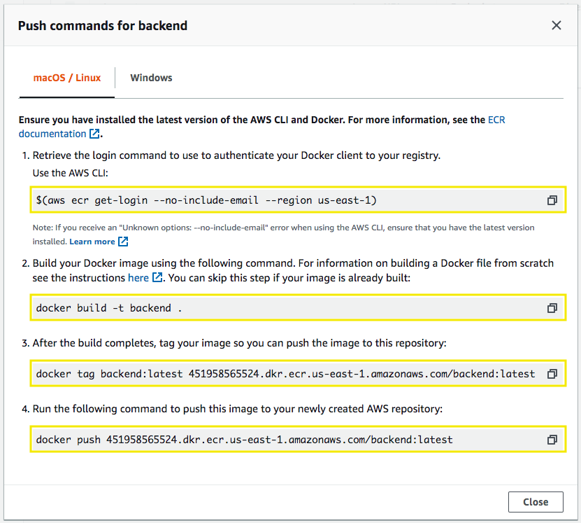
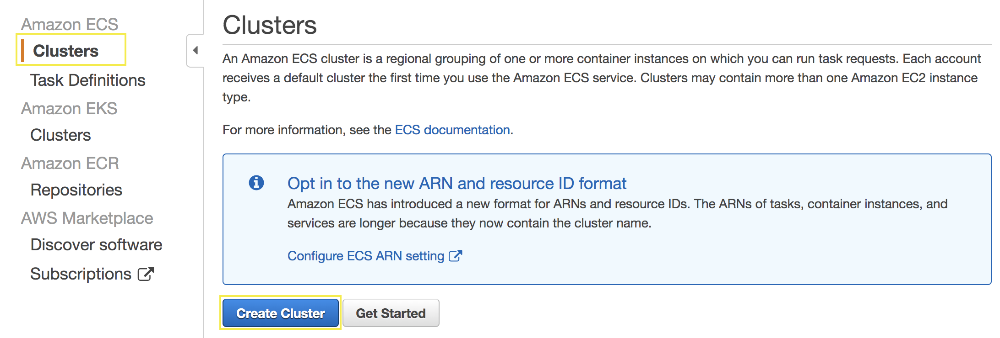
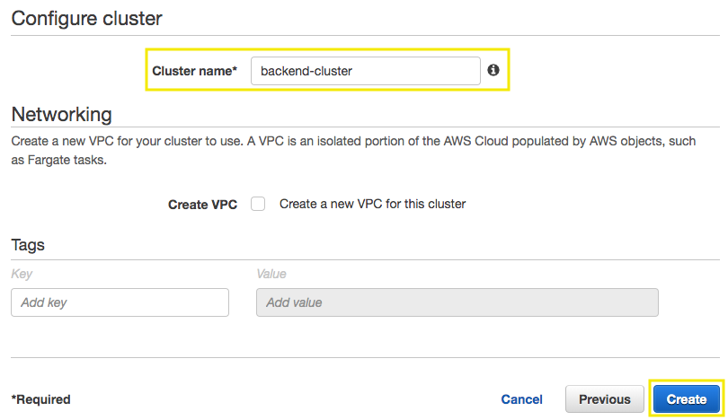
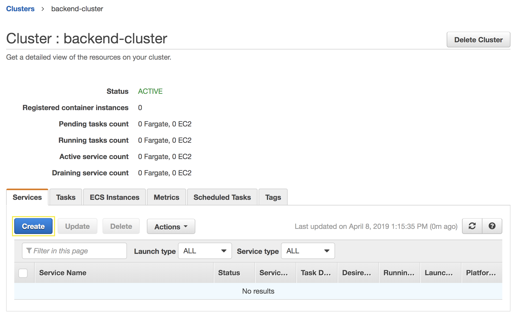
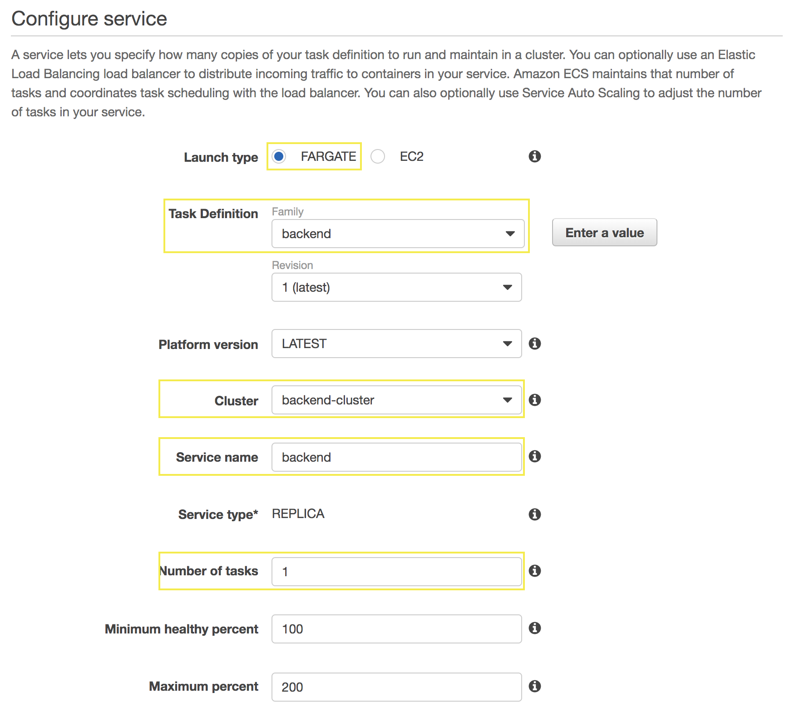
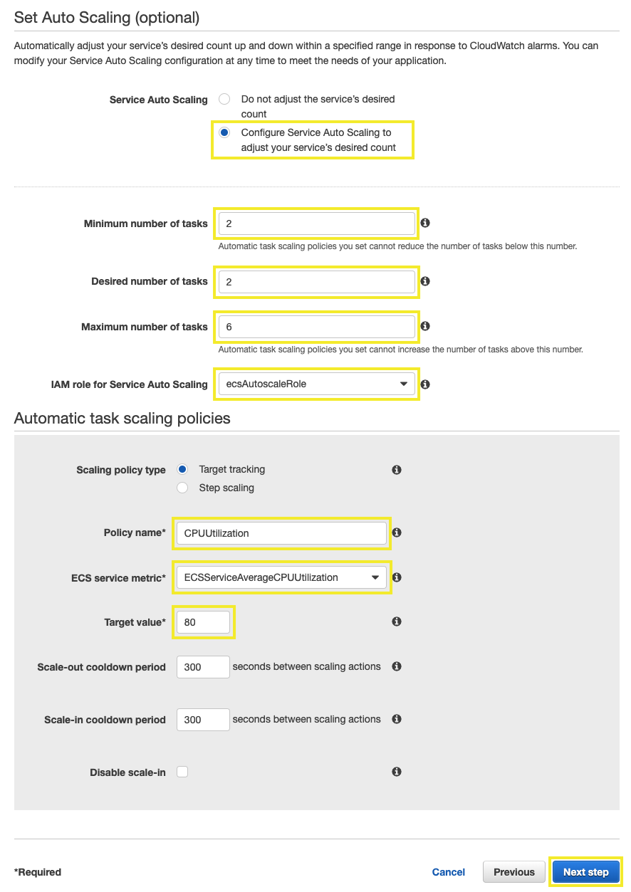

# Deploy a Node.js backend with Amazon ECS

## 1. Create the backend docker image and upload to Amazon ECR

1.1\. Inside your Cloud9 environment got to the backend folder.

``` bash
cd /home/ec2-user/environment/nodejs-back-and-angular-front/backend
```

1.2\. Install the node dependencies.

``` bash
npm install
```

1.3\. Open the Amazon ECR console at https://console.aws.amazon.com/ecr/repositories/.

1.4\. Click on **Create repository**, for the **Repository name** type `backend` and click **Create repository**.


1.5\. From the **Repositories** list, copy the **URI** for the **backend** repository, you will use it later.


1.6\. Click on the repository name **backend** and then click on **View push commands**.

1.7\. Go back to your Cloud9 environment in your backend folder and execute the 5 commands of **Push commands for backend** (macOS/Linux).



1.7\. After pushing to AWS repository you will see the following image in https://console.aws.amazon.com/ecr/repositories/backend/.


## 2. Create your Amazon ECS Task Execution IAM Role

2.1\. Open the IAM console at https://console.aws.amazon.com/iam/.

2.2\. Choose **Roles**, then **Create role**.

2.3\. Choose **Elastic Container Service** from the list of services, scroll down and choose **Elastic Container Service Task** that allows ECS tasks to call AWS services on your behalf for your use case, then **Next: Permissions**.


2.4\. For **attach permissions policies** filter by typing `AmazonECSTaskExecutionRolePolicy` and from the list select **AmazonECSTaskExecutionRolePolicy**, choose **Next: Tags**.


2.5\. For **Add tags** choose **Next: Review**.

2.6\. Give your role a **Name**, type `ecsTaskExecutionRole` and choose **Create Role**.

## 3. Create the Task Definition

3.1\. Open the Amazon ECS console at https://console.aws.amazon.com/ecs/.

3.2\. In the navigation pane, under **Amazon ECS**, choose **Task Definitions**.

3.3\. Choose **Create new Task Definition**.


3.4\. On the **Select launch type compatibility** use **FARGATE** and click on **Next step**.


3.5\. Complete the **Configure task and container definitions** page as follows:

* **``Task Definition Name``**: **``backend``**
* **``Task Role``**: Select **``None``**
* **``Task execution role``**: Select **``ecsTaskExecutionRole``**
* **``Task memory (GB)``**: Select **``0.5GB``**
* **``Task CPU (vCPU)``**: select **``0.25 vCPU``**

3.6\. Click on **Add container** and complete as follow and choose **Add**:

* **``Container Name``**: **``backend``**
* **``Image``**: paste the URI repository that you copied earlier in step 1.5.
* **``Port mappings``**: **``3000``** 


3.7\. Click on **Create**.

## 4. Create your Amazon ECS Service Auto Scaling IAM Role

4.1\. Open the IAM console at https://console.aws.amazon.com/iam/.

4.2\. Choose **Roles**, then **Create role**.

4.3\. Choose **Elastic Container Service** from the list of services, scroll down and choose **Elastic Container Service Autoscale** that allows Auto Scaling to access and update ECS services, then **Next: Permissions**.


4.4\. In **attach permissions policies**, the **AmazonEC2ContainerServiceAutoscaleRole** policy is selected, choose **Next: Tags**.


4.5\. For **Add tags** choose **Next: Review**.

4.6\. Give your role a **Name**, type `ecsAutoscaleRole` and choose **Create Role**.

## 5. Create an Amazon ECS cluster and Service for the backend

5.1\. Open the Amazon ECS console at https://console.aws.amazon.com/ecs/.

5.2\. In the navigation pane, under **Amazon ECS**, choose **Clusters**.

5.3\. Choose **Create Cluster**.



5.4\. Select the option **Networking only - Powered by AWS Fargate** and click on **Next step**.


5.5\. For **Cluster name** type `backend-cluster` and click on **Create**.



5.6\. Click on **View Cluster**.

5.7\. In the **Services** section, click on **Create**.



5.8\. Complete the **Configure service** page as follows:

* **``Launch type``**: **``FARGATE``**
* **``Task Definition``**: **``backend``**
* **``Cluster``**: **``backend-cluster``**
* **``Service name``**: **``backend``**
* **``Number of tasks``**: **``1``** 



5.9\. Click on **Next step**.

5.10\. Complete the **Configure network** page as follows:

* **``Cluster VPC``**: `My VPC`
* **``Subnets``**: Select `Private Subnet 01` and `Private Subnet 02`
* **``Auto-assign public IP``**: `DISABLED`


5.11\. For **``Security Groups``** click on **Edit**.

5.12\. Complete as follows and click on **Save**:

* **``Type``**: **``Custom TCP``**
* **``Port range``**: **``3000``**


5.13\. For **Load balancer type** select **``Application Load Balancer``**.

5.14\. For **Load balancer name** select **``backend``**.

5.15\. Click on **Add to load balancer**.


5.16\. For **Target group name** select **``backend``**.

5.17\. Uncheck the **Enable service discovery integration** and click on **Next step**.


5.18\. Complete the **Set Auto Scaling (optional)** page as follows and click on **Next step**.

* **``Service Auto Scaling``**: Select **Configure Service Auto Scaling to adjust your service’s desired count**
* **``Minimum number of tasks``**: **``2``**
* **``Desired number of tasks``**: **``2``**
* **``Maximum number of tasks``**: **``6``**
* **``IAM role for Service Auto Scaling``**: Select **``ecsAutoscaleRole``**
* **``Policy name``**: **``RequestCount``**
* **``ECS service metric``**: **``ALBRequestCountPerTarget``**
* **``Target value``**: **``100``**



!!! info
    **ALBRequestCountPerTarget** - Number of requests completed per target in an Application Load Balancer or a Network Load Balancer target group.

5.19\. Click on **Create Service** and click on **View Service** once the creation is finished.

5.20\. Wait a few seconds, you will see two tasks in running status.


5.21\. Open the Amazon EC2 console at https://console.aws.amazon.com/ec2/.

5.22\. In the navigation pane, under **LOAD BALANCING**, choose **Load Balancers**.

5.23\. Select the **backend** balancer, in the **Description** section copy the **DNS Name** to test in your bworser, you will see the code for the AWS Region.


5.24\. Test the DNS Name with `/messages` to see the messages.


## 6. Stress your Application Load Balancer with Siege

6.1\. Inside your Cloud9 environment install Siege.

``` bash
sudo yum install siege -y
```

6.2\. Stress your application load balancer for 10 minutes, change **`<dns-name-load-balancer`>** with your **DNS Name** balancer.

``` bash
siege -c100 -t10M http://<dns-name-load-balancer>/messages
```

More information for Siege: https://www.joedog.org/siege-manual/

6.3\. Wait for 5 minutes unitl you see more tasks created for your Service Cluster https://console.aws.amazon.com/ecs/home?region=us-east-1#/clusters.


