# Deploying backend container with AWS CodePipeline to Amazon ECS

## 1. Create a CodeCommit repository 

1.1\. Open the CodeCommit console at https://console.aws.amazon.com/codesuite/codecommit/home.

1.2\. On the Repositories page, choose **Create repository**.


1.3\. On the **Create repository** page, type `msg-app-backend` for **Repository name** and choose **Create**.

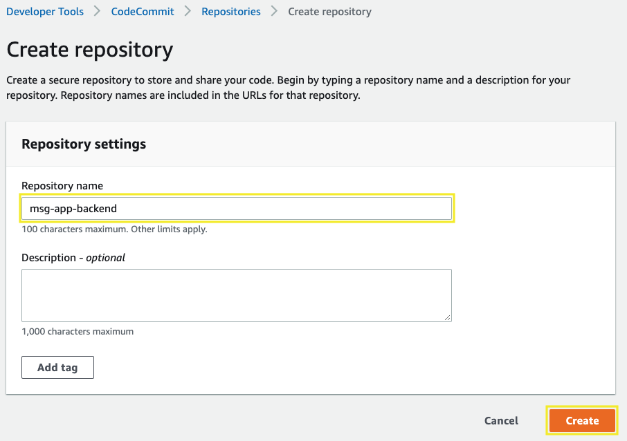

1.4\. Click on **Clone URL** and choose **Clone HTTPS**, the URL is copied, save it, you will use later.

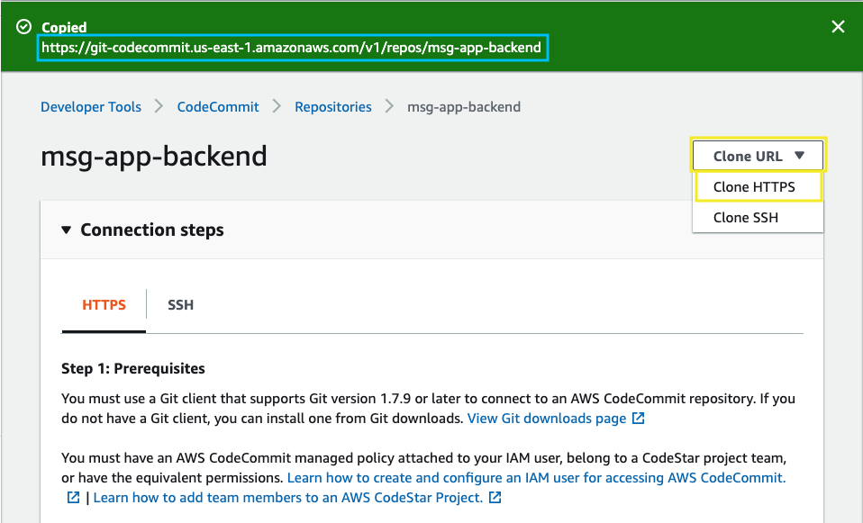

## 2. Create an IAM user for HTTPS Git credentials

2.1\. Open the IAM console at https://console.aws.amazon.com/iam/.

2.2\. In the navigation pane, choose **Users** and then choose **Add user**.

2.3\. In the **User Name** box, type `CodeCommitUser` as the name of the user, for **Access type** select the check box **Programmatic access** and then click **Next: Permissions**.


2.4\. For **Set permissions** select **Attach existing policies directly**, filter by typing `CodeCommitPowerUser` and from the list select **CodeCommitPowerUser** policy, choose **Next: Tags**.


2.5\. Choose **Next: Review** to see all of the choices you made up to this point. When you are ready to proceed, choose **Create user** and **Close**.


2.6\. From the users list, click on **CodeCommitUser**.


2.7\. On the user details page, choose the **Security Credentials** tab, and in **HTTPS Git credentials for AWS CodeCommit**, choose **Generate**.


2.8\. Copy the user name and password that IAM generated for you, either by showing, copying, and then pasting this information into a secure file on your local computer, or by choosing **Download credentials** to download this information as a .CSV file.


!!! info
    Open the csv file and use the new credentials to connect to CodeCommit.

## 3. Connect to CodeCommit and push changes to Git repository

3.1\. Open the AWS Cloud9 console at https://console.aws.amazon.com/cloud9/.

3.2\. In the list of environments, for the environment you want to open, inside of the card, choose **Open IDE**.

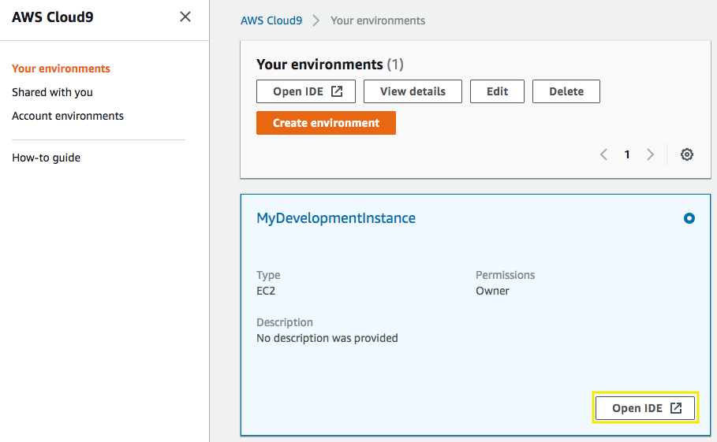

3.3\. Inside the Cloud9 environment, in the **bash** terminal go inside **msg-app-backend** folder and remove remote from git project.

``` bash
cd ~/environment/msg-app-backend/
git remote remove origin
```

3.4\. Use your URL repository to add your new origin.

``` bash
export MY_REGION=`aws configure get region`
git remote add origin https://git-codecommit.$MY_REGION.amazonaws.com/v1/repos/msg-app-backend
```

3.5\. Configure Git with your name and email.

``` bash
git config --global user.name "Your Name"
git config --global user.email you@example.com
```

3.6\. Edit the file **buildspec.yml** and replace **`<REPOSITORY_URI>`** with your URI from Amazon ECS Repository and save the file, use the editor included in Cloud9 environment.


``` bash
export REPOSITORY_URI=`aws ecr describe-repositories --repository-names my-api | jq '.repositories[0].repositoryUri' | tr -d \"`
sed -i "s~<REPOSITORY_URI>~$REPOSITORY_URI~g" buildspec.yml
```

3.7\. Push the project to your repository using the HTTPS Git Credentials.

``` bash
git add .
git commit -m "Buildspec"
git push origin master
```


## 4. Create Your Pipeline

4.1\. Open the AWS CodePipeline console at http://console.aws.amazon.com/codesuite/codepipeline/home.

4.2\. On the **Pipelines** page, choose **Create pipeline**.


4.3\. In **Step 1: Choose pipeline settings**, in **Pipeline name**, enter `BackendApi` and choose **Next**.

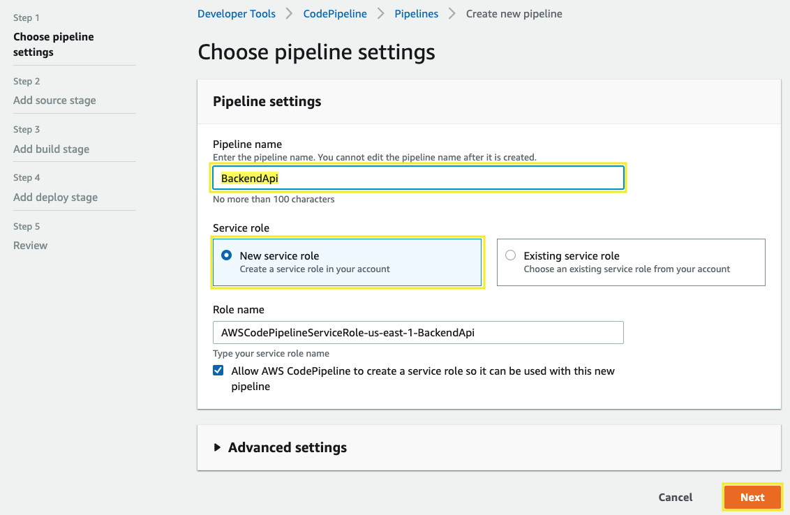

4.4\. In **Step 2: Add source stage**, in **Source provider**, choose **AWS CodeCommit**, For the **Repository name** select **msg-app-backend** and for **Branch name** select **master**. Choose **Next**.

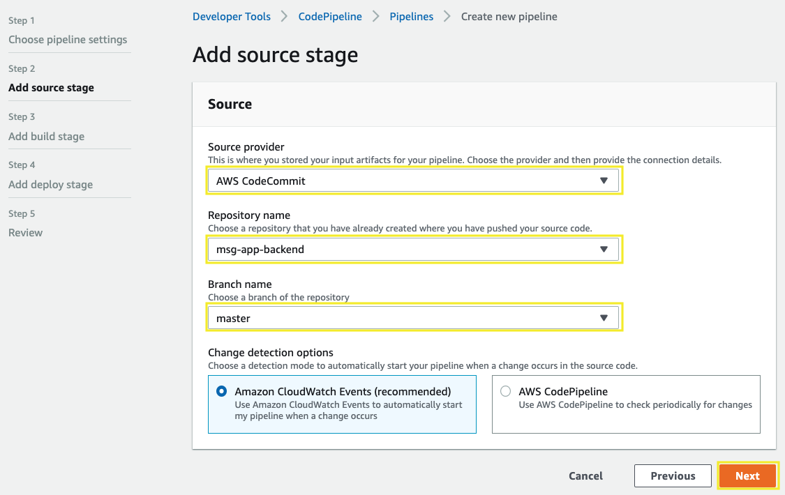

4.5\. In **Step 3: Add build stage**, select **AWS CodeBuild** and choose **Create project**.

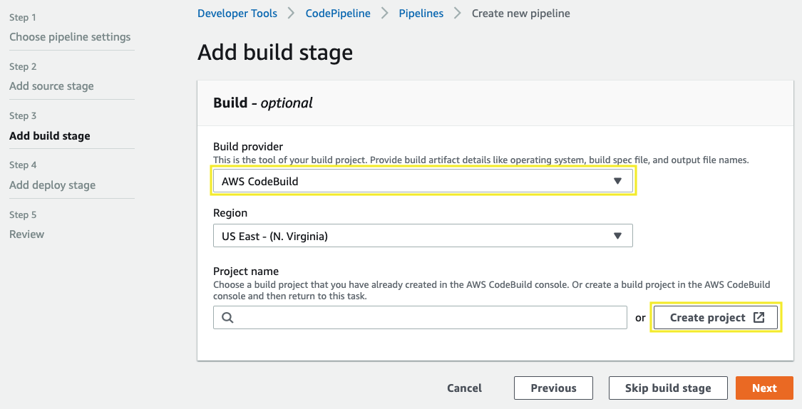

4.6\. For **Create build project** window, complete as follows and choose **Continue to CodePipeline**:

* **Project name**: **``BackendApi``**
* **Operating system**: Select **``Ubuntu``**
* **Runtime(s)**: Select **``Standard``**
* **Image**: Select **``aws/codebuild/standard:2.0``**
* **Image version**: select **``Always use the latest image for this runtime version``**
* **Privileged**: check **``Enable this flag if you want to build Docker images or want your builds to get elevated privileges``**


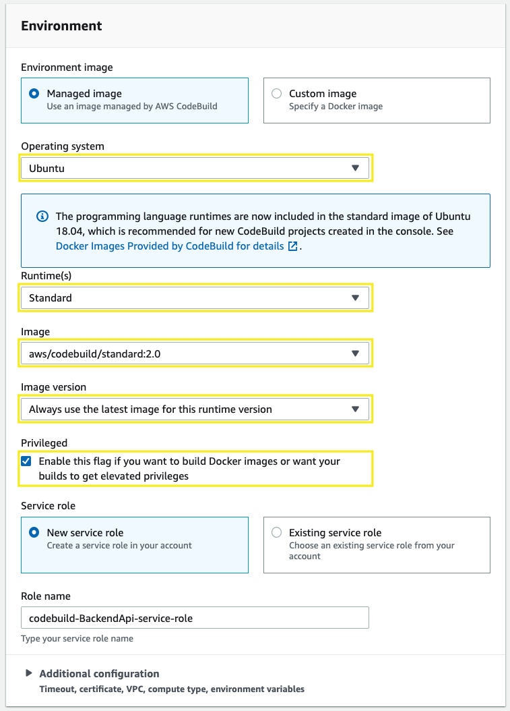

4.7\. Choose **Next**.

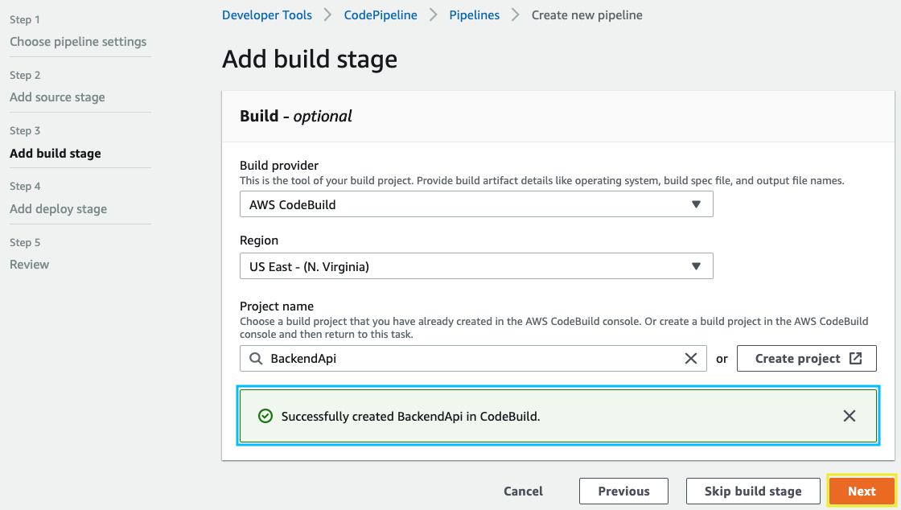

4.8\. In **Step 4: Add deploy stage**, choose **Amazon ECS**, for the **Cluster name** select **backend-cluster** and for **Service name** select **backend**, and choose **Next**.

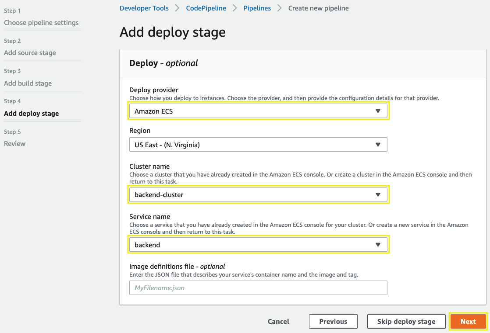

4.9\. In **Step 5: Review**, review the information, and then choose **Create pipeline**.

!!! info
    Your build stage is going to fail, next steps will help to fix it.

## 5. Add permissions to CodeBuild Service Role

5.1\. Open the IAM console at https://console.aws.amazon.com/iam/.

5.2\. In the navigation pane, choose **Roles** and search `codebuild-BackendApi-service-role`, click the **Role name**.


5.3\. For **Permissions** choose **Attach policies**.


5.4\. For **Attach Permissions** filter by `AmazonEc2ContainerRegistryPowerUser` and select the **AmazonEc2ContainerRegistryPowerUser** policy, choose **Attach policy**.

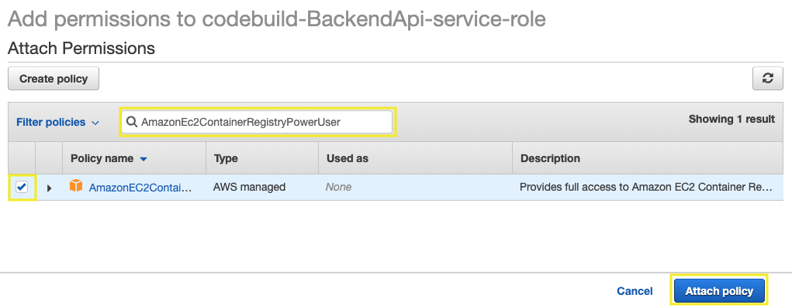

## 6. Release a change again for your Pipeline

6.1\. Open the AWS CodePipeline console at http://console.aws.amazon.com/codesuite/codepipeline/home.

6.2\. On the **Pipelines** page, choose **BackendApi**.


6.3\. Choose **Release changes** and **Release**.

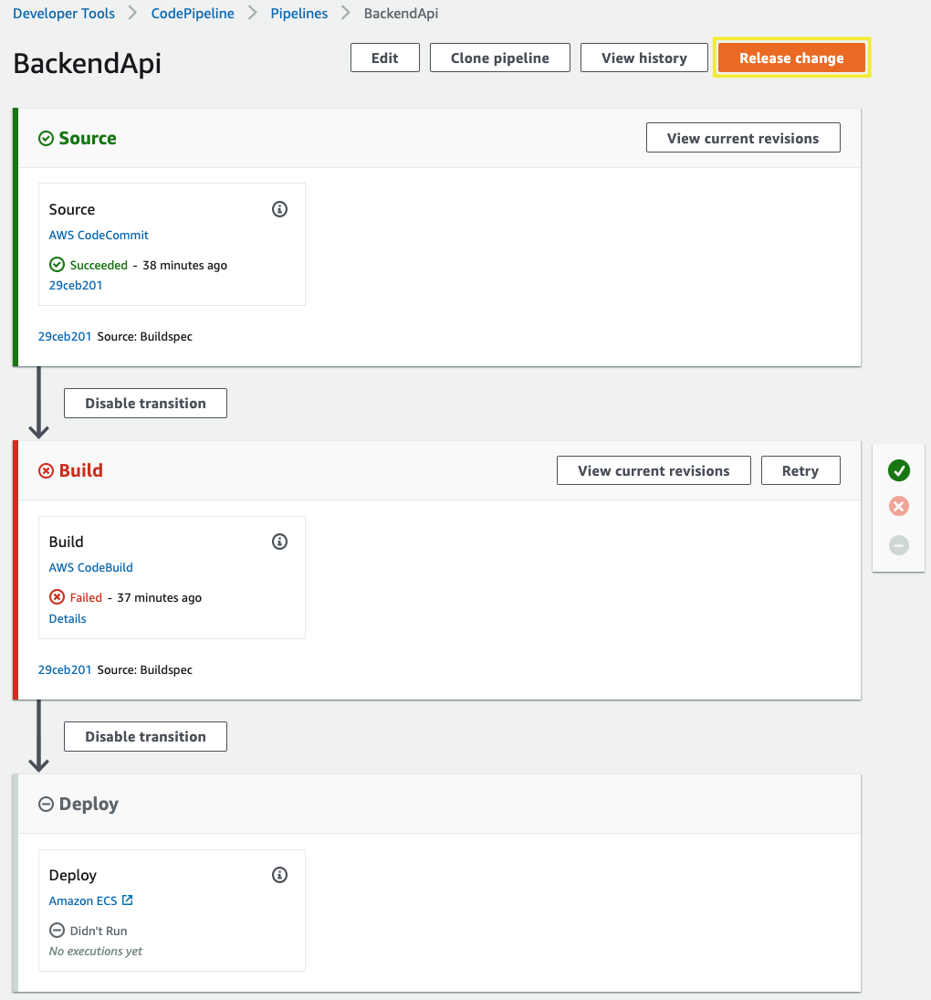


6.4\. Wait a few minutes until the deploy is completed.

