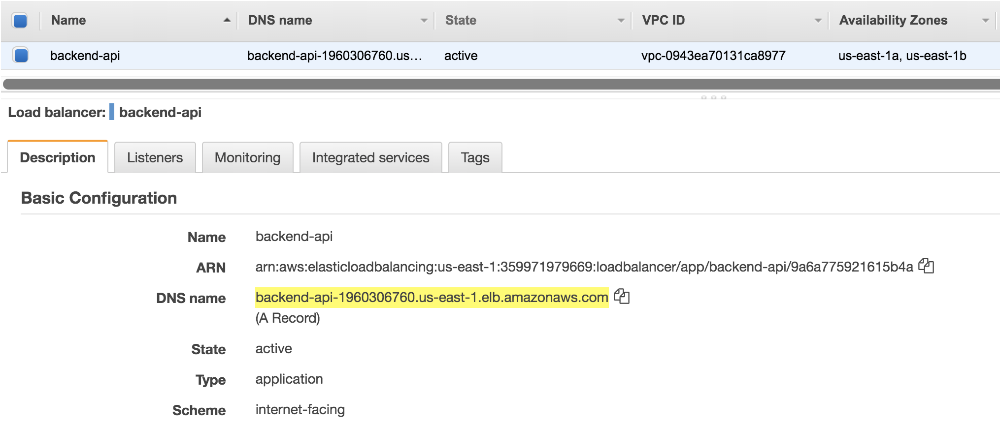

# Use ECS CLI to deploy the backend application

## 1. Install requirements

1.1\. Install the Amazon ECS CLI.

``` bash
sudo curl -o /usr/local/bin/ecs-cli https://amazon-ecs-cli.s3.amazonaws.com/ecs-cli-linux-amd64-latest
sudo chmod +x /usr/local/bin/ecs-cli
ecs-cli --version
```

Reference: https://docs.aws.amazon.com/AmazonECS/latest/developerguide/ECS_CLI_installation.html

1.2\. Install the JQ command.

``` bash
sudo yum install jq
```

## 2. Cloning a repository from GitHub

2.1 Cloning a repository from GitHub.

``` bash
git clone https://github.com/aurbac/msg-app-backend.git
cd msg-app-backend/
```

## 3. Create a DynamoDB table with AWS CloudFormation

3.1\. Create a simple DynamoDB table to store the messages for our application, by executing the following command the table is created using AWS CloudFormation.

``` bash
aws cloudformation create-stack --stack-name MsgApp --template-body file://db/msg-app-dynamodb.json --parameters ParameterKey=BillOnDemand,ParameterValue=true ParameterKey=ReadCapacityUnits,ParameterValue=5 ParameterKey=WriteCapacityUnits,ParameterValue=10
```

3.2\. Obtain the DynamoDB Table name and export it as an environment variable.

``` bash
export MY_TABLE_NAME=`aws cloudformation describe-stacks --stack-name MsgApp | jq '.Stacks[0].Outputs[0].OutputValue' | tr -d \"`
echo $MY_TABLE_NAME
```

3.3\. Feed the DynamoDB Table.

``` bash
python db/batch_writing.py
```

## 4. Create an Amazon VPC with AWS CloudFormation

4.1\. Create the Amazon VPC with two public and two private subnets using AWS CloudFormation.

``` bash
aws cloudformation create-stack --stack-name MyVPC --template-body file://vpc/AURBAC-VPC-Public-And-Private.json --parameters ParameterKey=VpcCidrBlock,ParameterValue=10.1.0.0/16 ParameterKey=VpcCidrBlockPrivateSubnet01,ParameterValue=10.1.2.0/24 ParameterKey=VpcCidrBlockPrivateSubnet02,ParameterValue=10.1.3.0/24 ParameterKey=VpcCidrBlockPublicSubnet01,ParameterValue=10.1.0.0/24 ParameterKey=VpcCidrBlockPublicSubnet02,ParameterValue=10.1.1.0/24
```

!!! info
    Wait about 5 minutes until the CloufFormation Stack status is **CREATE_COMPLETE**, got to your AWS CloudFormation console https://console.aws.amazon.com/cloudformation.

4.2\. Obtain the resource Ids and export them as environment variables.

``` bash
export VPC_ID=`aws cloudformation describe-stack-resources --stack-name MyVPC --logical-resource-id Vpc | jq '.StackResources[0].PhysicalResourceId' | tr -d \"`
export PRIVATE_SUBNET_01=`aws cloudformation describe-stack-resources --stack-name MyVPC --logical-resource-id PrivateSubnet01 | jq '.StackResources[0].PhysicalResourceId' | tr -d \"`
export PRIVATE_SUBNET_02=`aws cloudformation describe-stack-resources --stack-name MyVPC --logical-resource-id PrivateSubnet02 | jq '.StackResources[0].PhysicalResourceId' | tr -d \"`
export PUBLIC_SUBNET_01=`aws cloudformation describe-stack-resources --stack-name MyVPC --logical-resource-id PublicSubnet01 | jq '.StackResources[0].PhysicalResourceId' | tr -d \"`
export PUBLIC_SUBNET_02=`aws cloudformation describe-stack-resources --stack-name MyVPC --logical-resource-id PublicSubnet02 | jq '.StackResources[0].PhysicalResourceId' | tr -d \"`
echo $VPC_ID
echo $PRIVATE_SUBNET_01
echo $PRIVATE_SUBNET_02
echo $PUBLIC_SUBNET_01
echo $PUBLIC_SUBNET_02
```

## 5. Create the Application Load Balancer using the AWS CLI

5.1\. Create a Security Group for your Application Load Balancer.

``` bash
export SG_API_ALB=`aws ec2 create-security-group --group-name "api-alb" --description "ALB Security Group" --vpc-id $VPC_ID | jq '.GroupId' | tr -d \"`
aws ec2 authorize-security-group-ingress --group-id $SG_API_ALB --protocol tcp --port 80 --cidr 0.0.0.0/0
```

5.2\. Create an Application Load Balancer.

``` bash
export LOAD_BALANCER_ARN=`aws elbv2 create-load-balancer --name backend-api --type application --security-groups $SG_API_ALB --subnets $PUBLIC_SUBNET_01 $PUBLIC_SUBNET_02 | jq '.LoadBalancers[0].LoadBalancerArn' | tr -d \"`
```

5.3\. Create a Target Group for your Application Load Balancer.

``` bash
export TARGET_GROUP_ARN=`aws elbv2 create-target-group --name my-target-alb --protocol HTTP --port 80 --health-check-protocol HTTP --health-check-path /api --vpc-id $VPC_ID --target-type ip | jq '.TargetGroups[0].TargetGroupArn' | tr -d \"`
```

5.4\. Create a Listener for your Application Load Balancer.

``` bash
export LISTENER_ARN=`aws elbv2 create-listener --load-balancer-arn $LOAD_BALANCER_ARN --protocol HTTP --port 80 --default-actions Type=forward,TargetGroupArn=$TARGET_GROUP_ARN | jq '.Listeners[0].ListenerArn' | tr -d \"`
```

## 6. Create an ECS Cluster and configure ECS CLI

6.1\. The following command creates a ECS Cluster using the ECS-CLI.

``` bash
ecs-cli up --cluster myCluster --launch-type FARGATE --vpc $VPC_ID --subnets $PRIVATE_SUBNET_01,$PRIVATE_SUBNET_02
```

6.2\. Configure the cluster as local configuration.

``` bash
ecs-cli configure --cluster myCluster --region us-east-1 --default-launch-type FARGATE --config-name myCluster
```

## 7. Create the Image Docker and upload to Elastic Container Registry

7.1\. Install the application dependencies.

``` bash
npm install
```

7.2\. Create the Image Repository.

``` bash
aws ecr create-repository --repository-name my-api
```

7.3\. Build the image docker.

``` bash
docker build -t my-api .
```

7.4\. Upload the local image using the ECS CLI.

``` bash
ecs-cli push my-api --cluster-config myCluster
```

## 8. Create Security Group for my ECS Service

``` bash
export SG_SERVICE_API=`aws ec2 create-security-group --group-name "service-api" --description "My security group for API" --vpc-id $VPC_ID | jq '.GroupId' | tr -d \"`
aws ec2 authorize-security-group-ingress --group-id $SG_SERVICE_API --protocol tcp --port 3000 --cidr 0.0.0.0/0
echo $SG_SERVICE_API
```

## 9. Create a Role for your Task Execution

``` bash
cat > /tmp/task-execution-assume-role.json <<EOL
{
  "Version": "2012-10-17",
  "Statement": [
    {
      "Sid": "",
      "Effect": "Allow",
      "Principal": {
        "Service": "ecs-tasks.amazonaws.com"
      },
      "Action": "sts:AssumeRole"
    }
  ]
}
EOL
aws iam create-role --role-name ecsTaskExecutionRole --assume-role-policy-document file:///tmp/task-execution-assume-role.json
aws iam attach-role-policy --role-name ecsTaskExecutionRole --policy-arn arn:aws:iam::aws:policy/service-role/AmazonECSTaskExecutionRolePolicy
```

## 10. Create a Role for your Service Tasks

``` bash
cat > /tmp/task-execution-assume-role-dynamodb.json <<EOL
{
  "Version": "2012-10-17",
  "Statement": [
    {
      "Sid": "",
      "Effect": "Allow",
      "Principal": {
        "Service": "ecs-tasks.amazonaws.com"
      },
      "Action": "sts:AssumeRole"
    }
  ]
}
EOL
aws iam create-role --role-name ecsTaskServiceRole --assume-role-policy-document file:///tmp/task-execution-assume-role-dynamodb.json
aws iam attach-role-policy --role-name ecsTaskServiceRole --policy-arn arn:aws:iam::aws:policy/AmazonDynamoDBReadOnlyAccess
```

## 11. Replace values in files: docker-compose.yml & ecs-params.yml

``` bash
export MY_TABLE_NAME=`aws cloudformation describe-stacks --stack-name MsgApp | jq '.Stacks[0].Outputs[0].OutputValue' | tr -d \"`
sed -i "s/<MY_TABLE_NAME>/$MY_TABLE_NAME/g" docker-compose.yml
```

``` bash
export IMAGE_URI=`aws ecr describe-repositories --repository-names my-api| jq '.repositories[0].repositoryUri' | tr -d \"`
sed -i "s~<IMAGE_URI>~$IMAGE_URI~g" docker-compose.yml
```

``` bash
export PRIVATE_SUBNET_01=`aws cloudformation describe-stack-resources --stack-name MyVPC --logical-resource-id PrivateSubnet01 | jq '.StackResources[0].PhysicalResourceId' | tr -d \"`
export PRIVATE_SUBNET_02=`aws cloudformation describe-stack-resources --stack-name MyVPC --logical-resource-id PrivateSubnet02 | jq '.StackResources[0].PhysicalResourceId' | tr -d \"`
sed -i "s/<PRIVATE_SUBNET_01>/$PRIVATE_SUBNET_01/g" ecs-params.yml
sed -i "s/<PRIVATE_SUBNET_02>/$PRIVATE_SUBNET_02/g" ecs-params.yml
```

``` bash
export SG_SERVICE_API=`aws ec2 describe-security-groups --filters Name=group-name,Values=service-api | jq '.SecurityGroups[0].GroupId' | tr -d \"`
sed -i "s/<SG_SERVICE_API>/$SG_SERVICE_API/g" ecs-params.yml
```

``` bash
export TASK_ROLE_ARN=`aws iam get-role --role-name ecsTaskServiceRole | jq '.Role.Arn' | tr -d \"`
sed -i "s~<TASK_ROLE_ARN>~$TASK_ROLE_ARN~g" ecs-params.yml
```

## 12. Create my ECS Service

12.1\. Obtain the Target Group Arn where your container service will be delivered.

``` bash
export TARGET_GROUP_ARN=`aws elbv2 describe-target-groups --names my-target-alb | jq '.TargetGroups[0].TargetGroupArn' | tr -d \"`
```

12.2\. Create the ECS Service using the ECS CLI.

``` bash
ecs-cli compose --project-name backend-api service up \
--deployment-min-healthy-percent 0 \
--target-group-arn $TARGET_GROUP_ARN \
--container-name api \
--container-port 3000 \
--cluster-config myCluster \
--create-log-groups
```
12.3\. Open the Amazon EC2 console at https://console.aws.amazon.com/ec2/.

12.4\. In the navigation pane, under **LOAD BALANCING**, choose **Load Balancers**.

12.5\. Select the **backend** balancer, in the **Description** section copy the **DNS Name** to test in your bworser, you will see the code for the AWS Region.



12.6\. Test the DNS Name with `/api/messages` to see the messages.

