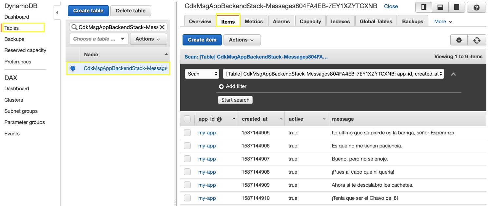
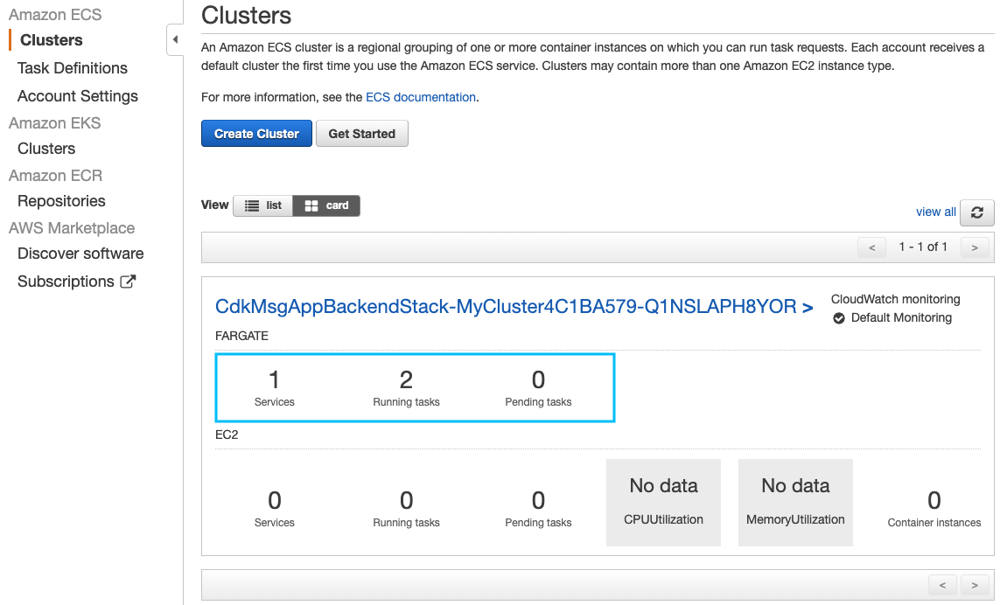
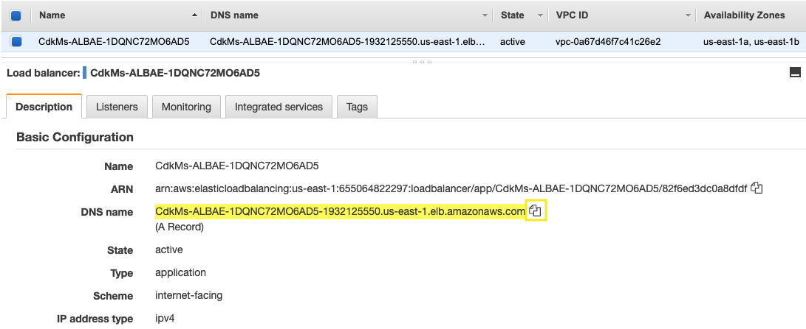
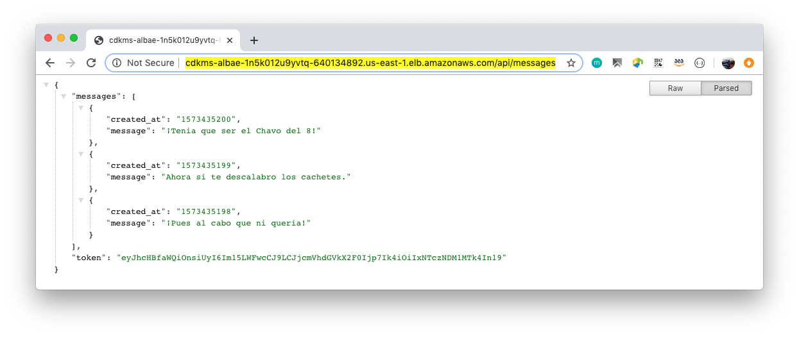
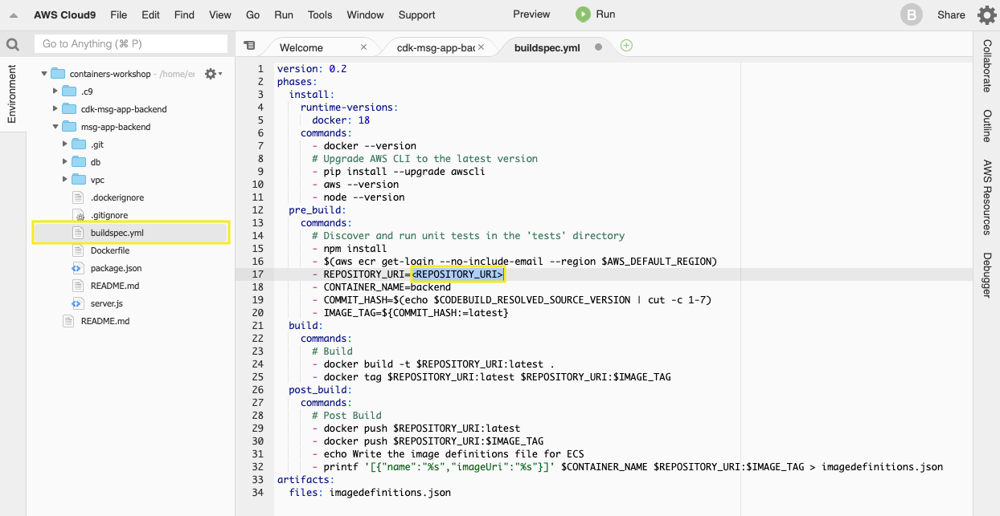

# Deploying a Node.js backend using the AWS CDK

## 1. Install requirements

1.1\. Install the Amazon ECS CLI, will be used to push the image docker to an Amazon ECR repository with the **ecs-cli push** command.

``` bash
sudo curl -o /usr/local/bin/ecs-cli https://amazon-ecs-cli.s3.amazonaws.com/ecs-cli-linux-amd64-latest
sudo chmod +x /usr/local/bin/ecs-cli
ecs-cli --version
```

Reference: https://docs.aws.amazon.com/AmazonECS/latest/developerguide/ECS_CLI_installation.html

1.2\. Install the AWS Cloud Development Kit.

``` bash
npm install -g aws-cdk
cdk --version
```

Reference: https://docs.aws.amazon.com/cdk/latest/guide/getting_started.html#getting_started_install

1.3\. Install the JQ command.

``` bash
sudo yum install jq -y
```

1.4\. Inside your **environment** folder clone the repository project from GitHub.

``` bash
cd ~/environment/
git clone https://github.com/aurbac/msg-app-backend.git
```

1.5\. Install the latest Boto 3 release via pip.

``` bash
python -m pip install --user boto3
```

## 2. Creating and initializing a new AWS CDK app

2.1\. Create a directory for your app with an empty Git repository.

``` bash
cd ~/environment/
mkdir cdk-msg-app-backend
cd cdk-msg-app-backend
```

2.2\. To initialize your new AWS CDK app use the **cdk init** command as follows.

``` bash
cdk init --language typescript
```

2.3\. Install the packages required for this project.

``` bash
npm install \
@aws-cdk/aws-ec2 \
@aws-cdk/aws-ecs \
@aws-cdk/aws-ecr \
@aws-cdk/aws-ecs-patterns \
@aws-cdk/aws-iam \
@aws-cdk/aws-dynamodb \
@aws-cdk/aws-elasticloadbalancingv2 \
@aws-cdk/aws-codecommit \
@aws-cdk/aws-codebuild \
@aws-cdk/aws-codepipeline \
@aws-cdk/aws-codepipeline-actions
```

2.4. Explore your project directory, you will have the following files:

* **lib/cdk-msg-app-backend-stack.ts** is where your CDK application’s main stack is defined. This is the file we’ll working on.

* **bin/cdk-msg-app-backend.ts** is the entrypoint of the CDK application. It will load the stack defined in lib/cdk-msg-app-backend-stack.ts.


## 3. Creating an Amazon DynamoDB Table

3.1\. Add the following import statement to **lib/cdk-msg-app-backend-stack.ts**.

``` typescript
import dynamodb = require("@aws-cdk/aws-dynamodb");
```

3.2\. Replace the comment "**The code that defines your stack goes here**" at the end of the constructor with the following code.

``` typescript
    const table = new dynamodb.Table(this, 'Messages', {
      partitionKey: {
        name: 'app_id',
        type: dynamodb.AttributeType.STRING
      }, 
      sortKey: {
        name: 'created_at',
        type: dynamodb.AttributeType.NUMBER
      },
      billingMode: dynamodb.BillingMode.PAY_PER_REQUEST,
      removalPolicy: cdk.RemovalPolicy.DESTROY, // NOT recommended for production code
    });
    new cdk.CfnOutput(this, 'TableName', { value: table.tableName });
```

3.3\. Save it and make sure it builds and creates a stack.

``` bash
npm run build
cdk synth
```

3.4\. Deploy the stack.

``` bash
cdk deploy
```

3.5\. Open the Amazon DynamoDB console in **Tables** section https://console.aws.amazon.com/dynamodb/home?#tables:, you will see the **messages** table.

3.6 Go to your Node.js project folder.

``` bash
cd ~/environment/msg-app-backend/
```

3.7\. Obtain the DynamoDB Table name created and export it as an environment variable with the following command.

``` bash
export MY_TABLE_NAME=`aws cloudformation describe-stacks --stack-name CdkMsgAppBackendStack | jq '.Stacks[0].Outputs[0].OutputValue' | tr -d \"`
echo $MY_TABLE_NAME
```

3.8\. Feed the DynamoDB Table.

``` bash
python db/batch_writing.py
```
3.9\. Open the Amazon DynamoDB console in **Tables** section https://console.aws.amazon.com/dynamodb/home?#tables:, select your table and explore the **Items** inserted.



## 4. Creating the network environment with Amazon VPC

4.1 Return to your CDK project folder.

``` bash
cd ~/environment/cdk-msg-app-backend/
```

4.2\. Add the following import statement to **lib/cdk-msg-app-backend-stack.ts**.

``` typescript
import ec2 = require("@aws-cdk/aws-ec2");
```

4.3\. Add the following code at the end of the constructor.

``` typescript
    const vpc = new ec2.Vpc(this, "My-Vpc", {
      cidr: "10.1.0.0/16",
      natGateways: 1,
      subnetConfiguration: [
        {  cidrMask: 24, subnetType: ec2.SubnetType.PUBLIC, name: "Public" },
        {  cidrMask: 24, subnetType: ec2.SubnetType.PRIVATE, name: "Private" }
        ],
      maxAzs: 3 // Default is all AZs in region
    });
```

4.4\. Save it and make sure it builds and creates a stack.

``` bash
npm run build
cdk synth
```

4.5\. Deploy the stack.

``` bash
cdk deploy
```

4.6\. Open the Amazon VPC console on **Your VPCs** https://console.aws.amazon.com/vpc, you will see your new VPC with **2 public** and **2 private** subnets.

## 5. Creating an Amazon ECR repository

5.1\. Add the following import statement to **lib/cdk-msg-app-backend-stack.ts**.

``` typescript
import ecr = require("@aws-cdk/aws-ecr");
```

5.2\. Add the following code at the end of the constructor.

``` typescript
    const repository = new ecr.Repository(this, "Api", {
      repositoryName: "my-api"
    });
```

5.3\. Save it and make sure it builds and creates a stack.

``` bash
npm run build
cdk synth
```

5.4\. Deploy the stack.

``` bash
cdk deploy
```

5.5\. Open the Amazon ECR console on **Repositories** https://console.aws.amazon.com/ecr, you will see your new repository.

## 6. Create the Docker Image for your backend and upload it to your repo on Elastic Container Registry

6.1 Go to your Node.js project folder.

``` bash
cd ~/environment/msg-app-backend/
```

6.2\. Install the application dependencies.

``` bash
npm install
```

6.3\. Build the image docker.

``` bash
docker build -t my-api .
```

6.4\. Upload the local image using the ECS CLI.

``` bash
ecs-cli push my-api
```

## 7. Creating an Amazon ECS Cluster and Task Definition

7.1 Return to your CDK project folder.

``` bash
cd ~/environment/cdk-msg-app-backend/
```

7.2\. Add the following import statements to **lib/cdk-msg-app-backend-stack.ts**.

``` typescript
import ecs = require("@aws-cdk/aws-ecs");
import iam = require("@aws-cdk/aws-iam");
```

7.3\. Add the following code at the end of the constructor to create the Amazon ECS Cluster.

``` typescript
    const cluster = new ecs.Cluster(this, "MyCluster", {
      vpc: vpc
    });
```

7.4\. Add the following code at the end of the constructor to create the Task Definition that contains the Docker container to use.

``` typescript
    const executionRolePolicy =  new iam.PolicyStatement({
      effect: iam.Effect.ALLOW,
      resources: ['*'],
      actions: [
                "ecr:GetAuthorizationToken",
                "ecr:BatchCheckLayerAvailability",
                "ecr:GetDownloadUrlForLayer",
                "ecr:BatchGetImage",
                "logs:CreateLogStream",
                "logs:PutLogEvents"
            ]
    });
    
    const fargateTaskDefinition = new ecs.FargateTaskDefinition(this, 'ApiTaskDefinition', {
      memoryLimitMiB: 512,
      cpu: 256,
    });
    fargateTaskDefinition.addToExecutionRolePolicy(executionRolePolicy);
    fargateTaskDefinition.addToTaskRolePolicy(new iam.PolicyStatement({
      effect: iam.Effect.ALLOW,
      resources: ['*'],
      actions: ['dynamodb:*']
    }));
    
    const container = fargateTaskDefinition.addContainer("backend", {
      // Use an image from Amazon ECR
      image: ecs.ContainerImage.fromRegistry(repository.repositoryUri),
      environment: { 
        'DYNAMODB_MESSAGES_TABLE': table.tableName,
        'APP_ID' : 'my-app'
      }
      // ... other options here ...
    });
    
    container.addPortMappings({
      containerPort: 3000
    });
```

7.5\. Save it and make sure it builds and creates a stack.

``` bash
npm run build
cdk synth
```

7.6\. Deploy the stack.

``` bash
cdk deploy
```

Do you wish to deploy these changes (y/n)? **y**

7.7\. Open the Amazon ECS console on **Clusters** and **Task Definitions** https://console.aws.amazon.com/ecs/, you will see your new cluster and task definition.

## 8. Creating an Amazon ECS Service with AutoScaling and expose it using an Application Load Balancer

8.1\. Add the following import statements to **lib/cdk-msg-app-backend-stack.ts**.

``` typescript
import ecs_patterns = require("@aws-cdk/aws-ecs-patterns");
import elbv2 = require('@aws-cdk/aws-elasticloadbalancingv2');
```

8.2\. Add the following code at the end of the constructor to create the Fargate Service with Auto Scaling.

``` typescript
    const sg_service = new ec2.SecurityGroup(this, 'MySGService', { vpc: vpc });
    sg_service.addIngressRule(ec2.Peer.ipv4('0.0.0.0/0'), ec2.Port.tcp(3000));
    
    const service = new ecs.FargateService(this, 'Service', {
      cluster,
      taskDefinition: fargateTaskDefinition,
      desiredCount: 2,
      assignPublicIp: false,
      securityGroup: sg_service
    });
    
    // Setup AutoScaling policy
    const scaling = service.autoScaleTaskCount({ maxCapacity: 6, minCapacity: 2 });
    scaling.scaleOnCpuUtilization('CpuScaling', {
      targetUtilizationPercent: 50,
      scaleInCooldown: cdk.Duration.seconds(60),
      scaleOutCooldown: cdk.Duration.seconds(60)
    });
```

8.3\. Add the following code at the end of the constructor to create the Application Load Balancer and the Fargate Service associated.

``` typescript
    const lb = new elbv2.ApplicationLoadBalancer(this, 'ALB', {
      vpc,
      internetFacing: true
    });

    const listener = lb.addListener('Listener', {
      port: 80,
    });

    listener.addTargets('Target', {
      port: 80,
      targets: [service],
      healthCheck: { path: '/api/' }
    });

    listener.connections.allowDefaultPortFromAnyIpv4('Open to the world');
```

8.4\. Save it and make sure it builds and creates a stack.

``` bash
npm run build
cdk synth
```

8.5\. Deploy the stack.

``` bash
cdk deploy
```

Do you wish to deploy these changes (y/n)? **y**

8.6\. Open the Amazon ECS console on **Clusters** https://console.aws.amazon.com/ecs/, explore your cluster, you will see a service running with 2 tasks.



8.7\. Open the Amazon EC2 console at https://console.aws.amazon.com/ec2/.

8.8\. In the navigation pane, under **LOAD BALANCING**, choose **Load Balancers**.

8.9\. Select the **backend** balancer, in the **Description** section copy the **DNS Name** to test in your browser. you will see the code of the AWS Region you are using.



8.10\. Test the DNS Name with `/api/messages` to see the messages.



## 9. Create a CodeCommit repository

9.1\. Add the following import statement to **lib/cdk-msg-app-backend-stack.ts**.

``` typescript
import codecommit = require('@aws-cdk/aws-codecommit');
```

9.2\. Add the following code at the end of the constructor.

``` typescript
    const code = new codecommit.Repository(this, 'Repository' ,{
      repositoryName: 'msg-app-backend',
      description: 'Node.js backend.', // optional property
    });
```

9.3\. Save it and make sure it builds and creates a stack.

``` bash
npm run build
cdk synth
```

9.4\. Deploy the stack.

``` bash
cdk deploy
```

## 10. Create an IAM user for HTTPS Git credentials

10.1\. Open the IAM console at https://console.aws.amazon.com/iam/.

10.2\. In the navigation pane, choose **Users** and then choose **Add user**.

10.3\. In the **User Name** box, type `CodeCommitUser` as the name of the user, for **Access type** select the check box **Programmatic access** and then click **Next: Permissions**.


10.4\. For **Set permissions** select **Attach existing policies directly**, filter by typing `CodeCommitPowerUser` and from the list select **CodeCommitPowerUser** policy, choose **Next: Tags**.


10.5\. Choose **Next: Review** to see all of the choices you made up to this point. When you are ready to proceed, choose **Create user** and **Close**.


10.6\. From the users list, click on **CodeCommitUser**.


10.7\. On the user details page, choose the **Security Credentials** tab, and in **HTTPS Git credentials for AWS CodeCommit**, choose **Generate**.


10.8\. Copy the user name and password that IAM generated for you, either by showing, copying, and then pasting this information into a secure file on your local computer, or by choosing **Download credentials** to download this information as a .CSV file.


!!! info
    Open the csv file and use the new credentials to connect to CodeCommit.

## 11. Connect to CodeCommit and push changes to Git repository

11.1\. Inside the Cloud9 environment, in the **bash** terminal go inside **msg-app-backend** folder and remove remote from git project.

``` bash
cd ~/environment/msg-app-backend/
git remote remove origin
```

11.2\. Use your URL repository to add your new origin.

``` bash
export MY_REGION=`aws configure get region`
git remote add origin https://git-codecommit.$MY_REGION.amazonaws.com/v1/repos/msg-app-backend
```

11.3\. Configure Git with your name and email.

``` bash
git config --global user.name "Your Name"
git config --global user.email you@example.com
```

11.4\. Edit the file **buildspec.yml** and replace **`<REPOSITORY_URI>`** with your URI from Amazon ECR Repository and save the file, use the editor included in Cloud9 environment or run the following commands.

``` bash
export REPOSITORY_URI=`aws ecr describe-repositories --repository-names my-api | jq '.repositories[0].repositoryUri' | tr -d \"`
sed -i "s~<REPOSITORY_URI>~$REPOSITORY_URI~g" buildspec.yml
```



11.5\. Push the project to your repository using the HTTPS Git Credentials.

``` bash
git add .
git commit -m "Buildspec"
git push origin master
```


## 12. Create Your Pipeline

12.1 Return to your CDK project folder.

``` bash
cd ~/environment/cdk-msg-app-backend/
```

12.2\. Add the following import statements to **lib/cdk-msg-app-backend-stack.ts**.

``` typescript
import codebuild = require('@aws-cdk/aws-codebuild');
import codepipeline = require('@aws-cdk/aws-codepipeline');
import codepipeline_actions = require('@aws-cdk/aws-codepipeline-actions');
```

12.3\. Add the following code at the end of the constructor.

``` typescript
    const project = new codebuild.PipelineProject(this, 'MyProject',{
      environment: {
        buildImage: codebuild.LinuxBuildImage.STANDARD_2_0,
        privileged: true
      },
    });
    const buildRolePolicy =  new iam.PolicyStatement({
      effect: iam.Effect.ALLOW,
      resources: ['*'],
      actions: [
                "ecr:GetAuthorizationToken",
                "ecr:BatchCheckLayerAvailability",
                "ecr:GetDownloadUrlForLayer",
                "ecr:GetRepositoryPolicy",
                "ecr:DescribeRepositories",
                "ecr:ListImages",
                "ecr:DescribeImages",
                "ecr:BatchGetImage",
                "ecr:InitiateLayerUpload",
                "ecr:UploadLayerPart",
                "ecr:CompleteLayerUpload",
                "ecr:PutImage"
            ]
    });
    project.addToRolePolicy(buildRolePolicy);
    
    const sourceOutput = new codepipeline.Artifact();
    const buildOutput = new codepipeline.Artifact();
    const sourceAction = new codepipeline_actions.CodeCommitSourceAction({
      actionName: 'CodeCommit',
      repository: code,
      output: sourceOutput,
    });
    const buildAction = new codepipeline_actions.CodeBuildAction({
      actionName: 'CodeBuild',
      project,
      input: sourceOutput,
      outputs: [buildOutput],
    });
    
    new codepipeline.Pipeline(this, 'MyPipeline', {
      stages: [
        {
          stageName: 'Source',
          actions: [sourceAction],
        },
        {
          stageName: 'Build',
          actions: [buildAction],
        },
        {
          stageName: 'Deploy',
          actions: [
            new codepipeline_actions.EcsDeployAction({
              actionName: "ECS-Service",
              service: service, 
              input: buildOutput
            }
            )
          ]
        }
      ],
    });
```

!!! info
    You can find the [final file **lib/my_ecs_construct-stack.ts** here](https://github.com/aurbac/cdk-msg-app-backend/blob/master/lib/cdk-msg-app-backend-stack.ts). 

12.4\. Save it and make sure it builds and creates a stack.

``` bash
npm run build
cdk synth
```

12.5\. Deploy the stack.

``` bash
cdk deploy
```