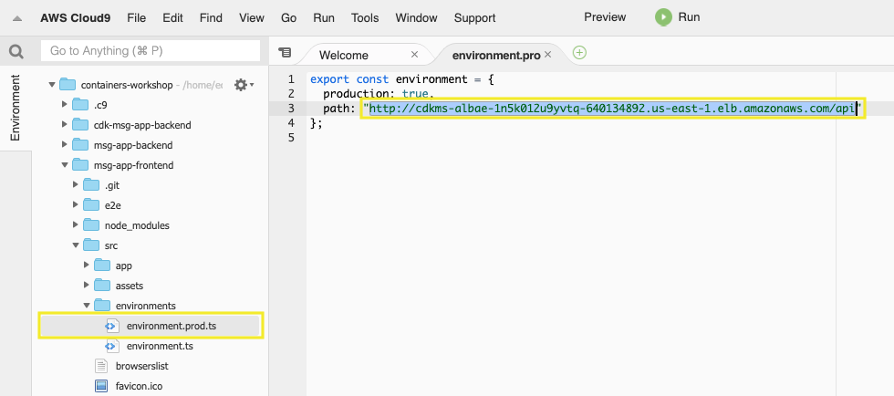
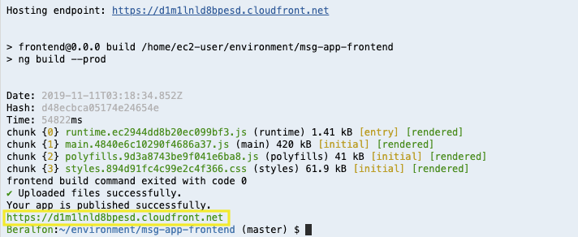
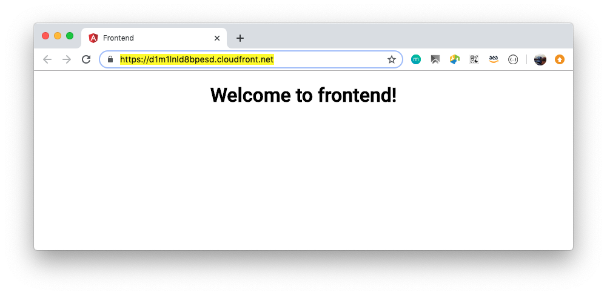
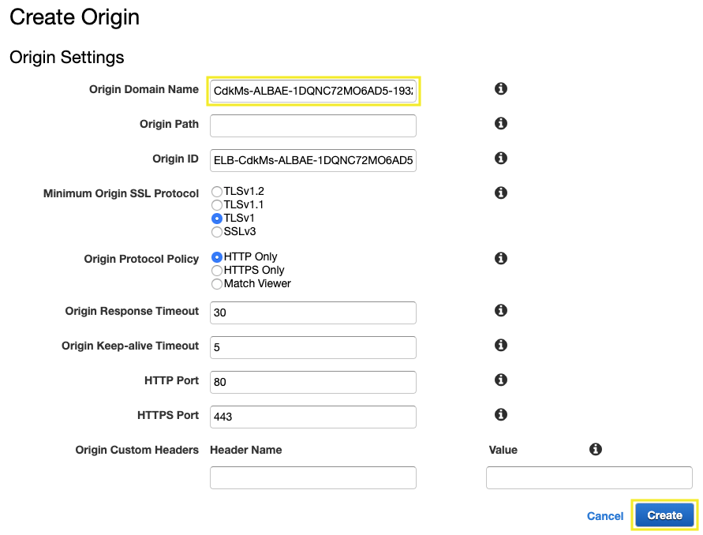
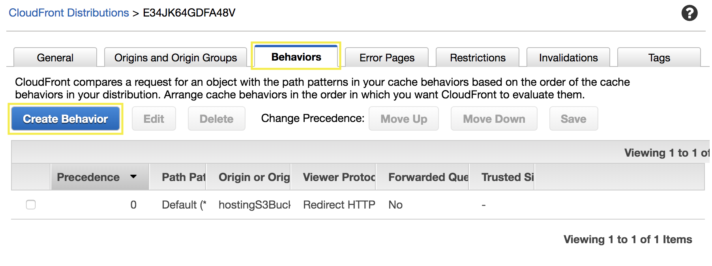
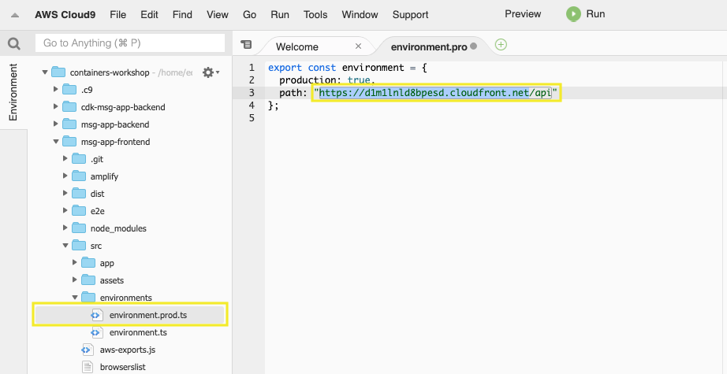
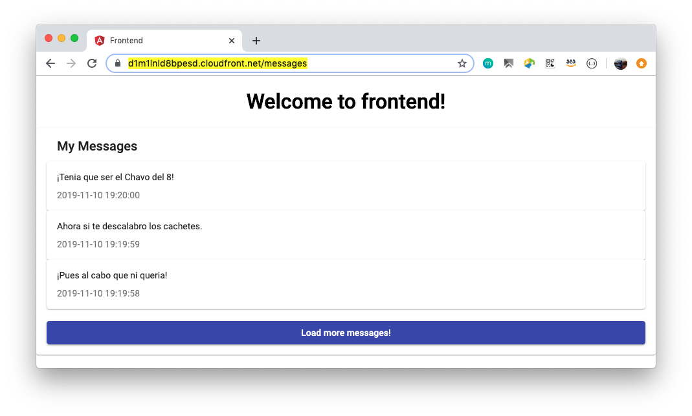

# Deploying an Angular frontend with Amazon S3 and Amazon CloudFront using AWS Amplify

## 1. Install global dependencies

1.1\. Update Node.js to the minimal version of 10.

``` bash
nvm i v10
```

1.2\. Install Amplify CLI tool https://github.com/aws-amplify/amplify-cli

``` bash
npm install -g @aws-amplify/cli
```

1.3\. Install the Angular CLI globally.

``` bash
npm install -g @angular/cli
```

## 2. Clone the repository project from GitHub and install dependencies

2.1\. Clone the Github project and install dependencies.

``` bash
cd ~/environment/
git clone https://github.com/aurbac/msg-app-frontend.git
cd msg-app-frontend/
npm install
npm install --save aws-amplify aws-amplify-angular
```

2.2\. Edit the file **src/environments/environment.prod.ts** and change the value **path** with to your **`http://load-balancer-dns-name/api`** and save the file, use the editor included in Cloud9 environment.



## 3. Initialize amplify project

3.1\. Initialize the amplify project.

``` bash
amplify init
```

? Enter a name for the project **msg-app-frontend**

? Enter a name for the environment **dev**

? Choose your default editor: **Sublime Text**

? Choose the type of app that you're building **javascript**

Please tell us about your project

? What javascript framework are you using **angular**

? Source Directory Path:  **src**

? Distribution Directory Path: **dist/frontend** (Use this path)

? Build Command:  **npm run-script build**

? Start Command: **ng serve**

Using default provider  awscloudformation

For more information on AWS Profiles, see:

https://docs.aws.amazon.com/cli/latest/userguide/cli-multiple-profiles.html

? Do you want to use an AWS profile? **Yes**

? Please choose the profile you want to use **default**

## 4. Add hosting and publish your Angular project

4.1\. Add hosting to your amplify project.

``` bash
amplify add hosting
```

? Select the environment setup: **PROD (S3 with CloudFront using HTTPS)**

? hosting bucket name **msg-app-frontend-20190709233955-hostingbucket** (Use default name)

? index doc for the website **index.html**

? error doc for the website **index.html**

4.2\. Publish your Angular project.

``` bash
amplify publish
```

? Are you sure you want to continue? **Yes**

4.3\. After your app is published, use the endpoint resulted to get into your application.

!!! info
    This may take a few minutes...





## 5. Configure backend with Amazon CloudFront

5.1\. Open the Amazon CloudFront console at https://console.aws.amazon.com/cloudfront/.

5.2\. Choose your distribution and click on Distribution Settings.


5.3\. Go to **Origins and Origin Groups** tab and click on **Create Origin**.


5.4\. For **Create Origin** select your Application Load Balancer and choose **Create**.



5.5\. Go to **Behaviors** tab and click on **Create Behavior**.



5.6\. For **Create Behavior** complete as follows and choose **Create**:

* **Path Pattern**: **``/api*``**
* **Origin or Origin Group**: **``ELB-CdkMs-ALBAE--XXXXX``**
* **Allowed HTTP Methods**: **``GET, HEAD, OPTIONS, PUT, POST, PATCH, DELETE``**
* **Cache Based on Selected Request Headers**: **``All``**
* **Forward Cookies**: **``All``**
* **Query String Forwarding and Caching**: **``Forward all, cache based on all``**


## 6. Update Angular project with backend CloudFront

6.1\. Edit the file **src/environments/environment.prod.ts** and change the value **path** with to your **`https://cloudfront-domain-name/api`** and save the file, use the editor included in Cloud9 environment.



6.2\. Publish your Angular project.

``` bash
amplify publish
```

6.3\. Now test in your browser the application messages `https://cloudfront-domain-name/messages`, you will see the messages from backend.



!!! done
    **Now you have an Angular Application stored on Amazon S3 and a Nodejs backend using containers with Amazon ECS.**