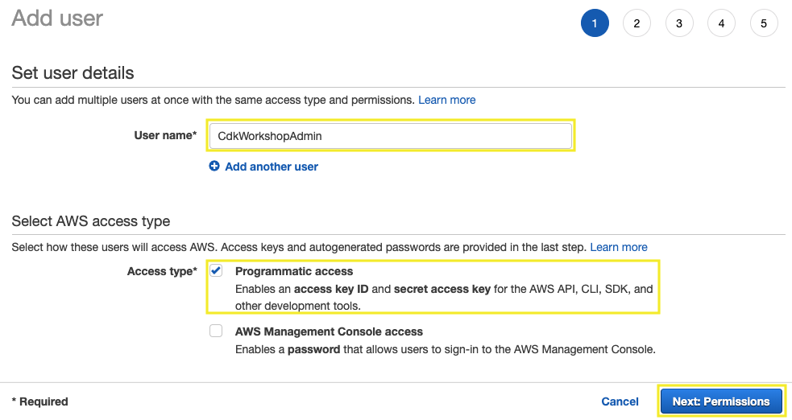
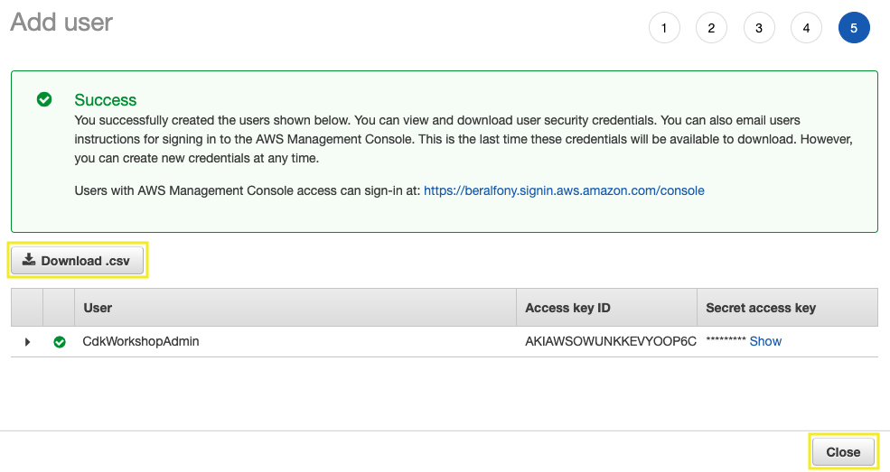
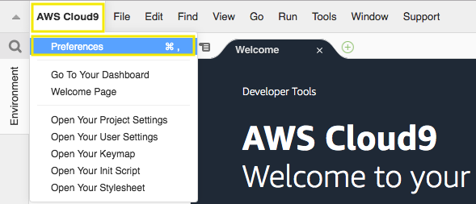

# Prepare your development environment

## 1. Create an IAM User with administrator privileges

1.1\. Open the IAM console at https://console.aws.amazon.com/iam/.

1.2\. Choose **Users**, then **Add user**.

1.3\. Type a name for your user `admin`, choose **Programmatic access** and click **Next: Permissions**.



1.4\. Click **Attach permissions policies** and select **Administrator Access**, choose **Next: Tags**.


1.5\. For **Add tags** choose **Next: Review**.

1.6\. Click **Create user**.

1.7\. To save the credentials, choose **Download .csv** and then save the file to a safe location, and **Close**.



## 2. Create a Cloud9 instance for development

2.1\. Open the AWS Cloud9 console at https://console.aws.amazon.com/cloud9/.

2.2\. Click on **Create environment**.


2.3\. For the **Name** type `MyDevelopmentInstance`, and choose **Next step**.


2.4\. For the **Configure settings** section use the default values and choose **Next step**.

2.5\. For the **Review** section click on **Create environment**.

2.6\. Wait a few seconds until your development environment is ready, you will see the following screen.


## 3. Update IAM settings for your Cloud9 Environment

3.1\. Inside the Cloud9 environment, click on **AWS Cloud9** and **Preferences**.



3.2\. Select **AWS SETTINGS** and turn off **AWS managed temporary credentials**.


## 4. Configure your AWS CLI

4.1\. Clear credentials files.

``` bash
rm ~/.aws/config
rm ~/.aws/credentials
```

4.2\. Inside the Cloud9 environment, in the **bash** terminal we are going to configure the AWS CLI as follows:

``` bash
aws configure
```

- Configuration:
    - AWS Access Key ID: **(Type your Access key ID)**
    - AWS Secret Access Key: **(Type your Secret access key)**
    - Default region name [None]: **us-east-1**
    - Default output format [None]: **json**
