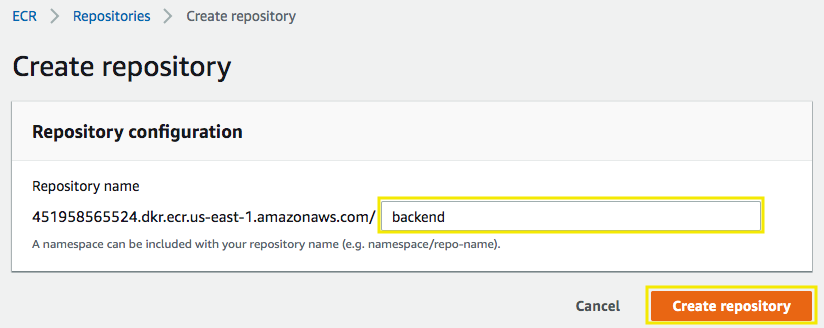

# Deploy a Node.js backend with Amazon ECS

## 1. Create the backend docker image and upload to Amazon ECR

1.1\. Inside your Cloud9 environment got to the backend folder.

```
cd /home/ec2-user/environment/nodejs-back-and-angular-front/backend
```

1.2\. Install the node dependencies.

```
npm install
```

1.3\. Open the Amazon ECR console at https://console.aws.amazon.com/ecr/repositories/.

1.4\. Click on **Create repository**, for the **Repository name** type `backend` and click **Create repository**.



**Note:** Copy the **URI** for the backend repository, you will use it later.

1.5\. Click on the repository name **backend** and then click on **View push commands**.

1.6\. Go back to your Cloud9 environment in your backend folder and execute the 5 commands of **Push commands for backend** (macOS/Linux).


## 2. Create the Task Definition

2.1\. Open the Amazon ECS console at https://console.aws.amazon.com/ecs/.

2.2\. In the navigation pane, under **Amazon ECS**, choose **Task Definitions**.

2.3\. Choose **Create new Task Definition**.

2.4\. On the **Select launch type compatibility** use **FARGATE** and click on **Next step**.

2.5\. Complete the **Configure task and container definitions** page as follows:

  a\. For **Task Definition Name** type `backend`.

  b\. For **Task Role** select `None` if available, otherwise leave it the same.

  c\. For **Task execution role** select `Create new role`.

  d\. For **Task memory (GB)** select `0.5GB`.

  e\. For **Task CPU (vCPU)** select `0.25 vCPU`.

  f\. Click on **Add container**.

  g\. For the **Container Name** type `backend`.

  h\. For the **Image** paste the URI repository that you copied earlier in step 4.4.

  i\. For the **Port mappings** type `3000` and click on **Add**.

  j\. Click on **Create**.

## 3. Create an Amazon ECS cluster and Service for the backend

3.1\. Open the Amazon ECS console at https://console.aws.amazon.com/ecs/.

3.2\. In the navigation pane, under **Amazon ECS**, choose **Clusters**.

3.3\. Choose **Create Cluster**.

3.4\. Select the option **Networking only - Powered by AWS Fargate** and click on **Next step**.

3.5\. For **Cluster name** type `backend-cluster` and click on **Create**.

3.6\. Click on **View Cluster**.

3.7\. In the **Services** sections click on **Create**.

3.8\. Complete the **Configure service** page as follows:

  a\. For **Launch type** select `FARGATE`.

  b\. For **Task Definition** select `backend`.

  b\. For **Cluster** select `backend-cluster`.

  c\. For **Service name** type `backend`.

  d\. For **Number of tasks** type `1`.

  e\. Click on **Next step**.

3.9\. Complete the **Configure network** page as follows:

  a\. For **Cluster VPC** select `My VPC`.

  b\. For **Subnets** select `Private Subnet 01` and `Private Subnet 02`.

  b\. For **Auto-assign public IP** select `DISABLED`.

  c\. For **Security Groups** click on **Edit**.

  d\. For **Inbound rules for security group** change the **Type** to `Custom TCP`.

  e\. For **Port range** type `3000` and click on **Save**.

  f\. For **Load balancer type** select **Application Load Balancer**.

  g\. For **Load balancer name** select `backend`.

  h\. Click on **Add to load balancer**.

  i\. For **Target group name** select `backend`.

  j\. Click on **Next step**.

3.10\. Complete the **Set Auto Scaling (optional)** page as follows:

  a\. For **Service Auto Scaling** select `Configure Service Auto Scaling to adjust your service’s desired count`.

  b\. For **Minimum number of tasks** type `2`.

  c\. For **Desired number of tasks** type `2`.

  d\. For **Maximum number of tasks** type `6`.

  e\. For **IAM role for Service Auto Scaling** select `Create new role` if available, otherwise leave it the same..

  f\. For **Policy name** type `RequestCount`.

  g\. For **ECS service metric** select `ALBRequestCountPerTarget`.

  h\. For **Target value** type `100`.

  i\. Click on **Next step**.

3.11\. Click on **Create Service**.

3.12\. Click on **View Service**.

3.13\. Open the Amazon EC2 console at https://console.aws.amazon.com/ec2/.

3.14\. In the navigation pane, under **LOAD BALANCING**, choose **Load Balancers**.

3.15\. Select the **backend** balancer, in the **Description** section copy the **DNS Name** to test in your bworser, you will see the code for the AWS Region.

3.16\. Test the DNS Name with `/messages` to see the messages.
